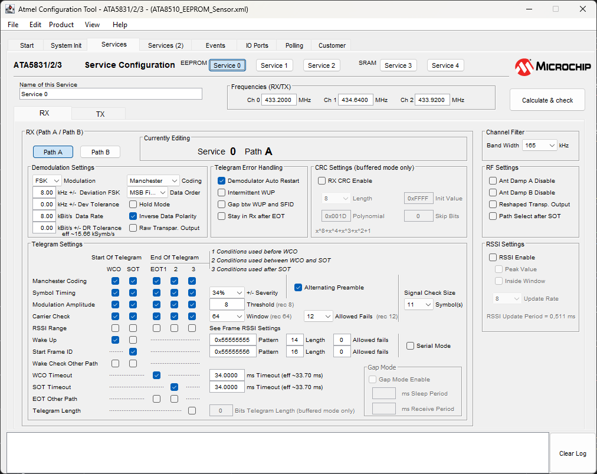
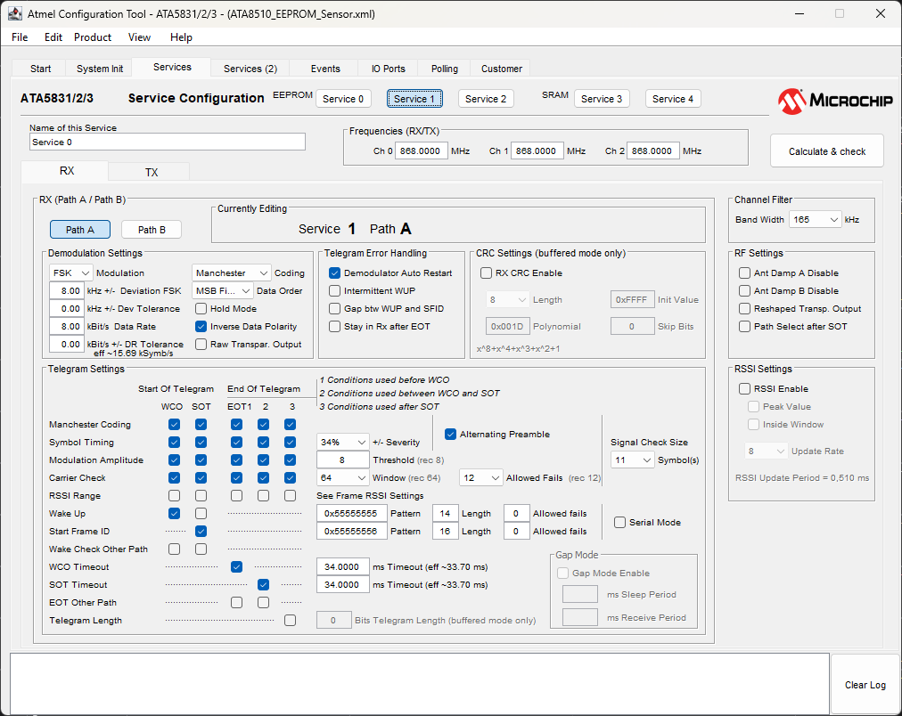

# ATA8510 RF Alarm System <!-- omit in toc -->


> "IoT Made Easy!" - This application example demonstrates a scalable tree-based wireless network using the ATA8510 RF MCU to enable a reliable alarm system deployments with a large number of nodes.

Devices: **| ATA8510 | SAMC21 |**<br>
Features: **| RF network topology |**

## ⚠ Disclaimer <!-- omit in toc -->
<b>
THE SOFTWARE ARE PROVIDED "AS IS" AND GIVE A PATH FOR SELF-SUPPORT AND SELF-MAINTENANCE. This repository contains example code intended to help accelerate client product development.  
<br>
<br>
For additional Microchip repos, see: <a href="https://github.com/Microchip-MPLAB-Harmony" target="_blank">https://github.com/Microchip-MPLAB-Harmony</a>
<br>
Checkout the <a href="https://microchipsupport.force.com/s/" target="_blank">Technical support portal</a> to access our knowledge base, community forums or submit support ticket requests.
</b>


## Contents <!-- omit in toc -->
- [Introduction](#introduction)
- [Solution Diagram](#solution-diagram)
- [Bill of Materials](#bill-of-materials)
- [Board programming](#board-programming)
- [EEPROM Configuration](#eeprom-configuration)
- [Applications](#applications)
- [Run the demo](#run-the-demo)
  - [System startup](#system-startup)
  - [Add a new sensor](#add-a-new-sensor)
    - [Learning mode](#learning-mode)
    - [Attach a new Sensor to the central](#attach-a-new-sensor-to-the-central)
  - [Trigger an alarm event](#trigger-an-alarm-event)
  - [Reset a sensor to factory settings](#reset-a-sensor-to-factory-settings)
- [Status](#status)
  - [Central V1.0.0](#central-v100)
    - [Features](#features)
    - [Known Issues](#known-issues)
  - [Next](#next)
- [Related links](#related-links)

## Introduction
This application example demonstrates a tree-based RF network topology using ATA8510 RF microcontrollers for commercial building automation systems, including fire alarm applications.  
The proposed architecture provides reliable, low-latency communication among distributed sensors, control panels, and actuators, while supporting scalability, fault tolerance, and regulatory compliance. By organizing devices in a hierarchical tree structure, the network optimizes routing efficiency, reduces RF congestion, and enables deterministic message delivery essential for safety‑critical systems.

## Solution Diagram


## Bill of Materials

| TOOLS | QUANTITY
|--     |--
| [SAMC21 Xplained Pro Evaluation Kit](https://www.microchip.com/en-us/development-tool/atsamc21-xpro) | 1
| [mikroBUS Xplained Pro](https://www.microchip.com/en-us/development-tool/atmbusadapter-xpro) | 1
| [ATA8510 Curiosity Board](https://www.microchip.com/en-us/development-tool/ev82m22a) | 2 - 5
<!--
| [Atmel-ICE](https://www.microchip.com/en-us/development-tool/atatmel-ice) or [Power Debugger](https://www.microchip.com/en-us/development-tool/atpowerdebugger) or [PICkit5](https://www.microchip.com/en-us/development-tool/pg164150) | 1
-->

## Board programming

The `/hex` folder contains the compiled application HEX files.

| Device | Target board          | Hex file
|--      |--                     |--
| Central| SAMC21 Xplained Pro   | [central.hex](./hex/central,hex)
| Sensor | ATA8510 Curiosity     | [sensor.hex](./hex/sensor.hex)


The EEPROM configuration [ATA8510_EEPROM.hex](./hex/ATA8510_EEPROM.hex) file is applicable to both the central and sensor applications.

Refer to the [Central](apps/central/README.md) and [Sensor](apps/sensor/README.md) documentation for the respective procedures to program each board.

## EEPROM Configuration

The EEPROM Configuration Tool has been used to generate the configuration data file required for EEPROM programming.

The EEPROM configuration [ATA8510_EEPROM.hex](./hex/ATA8510_EEPROM.hex) is common to all device types and is shared across all ATA8510 Curiosity Boards.

Users can customize the EEPROM configuration, including RF parameters such as frequency, data rate, modulation, bandwidth, deviation, etc., as needed using the EEPROM Configuration Tool.

EEPROM Configuration Tool can be downloaded from the software section of ATA8510 [product page](https://www.microchip.com/en-us/product/ata8510#Tools%20And%20Software).

The screenshot shows the Service Configuration for Service 0 (433 MHz). It is used in the demo application  


The screenshot shows the Service Configuration for Service 1 (868 MHz). It has not been tested yet.  


## Applications

The demo is structured into multiple projects. Refer to the following sections for detailed information on each.

| Section                             | Description |
| :-                                  | :-          |
| [Apps](./apps/README.md)            | This resource provides detailed descriptions of the implemented state machines, along with additional definitions illustrated using flowcharts. |
| [Central](./apps/central/README.md) | Technical details specific to the Central device |
| [Sensor](./apps/sensor/README.md)   | Technical details that are specific to the Sensor device |

[TOP](#contents)

## Run the demo

### System startup

1. Power the Central device via the Debug USB connector
2. Open a serial Terminal (115200 8 N 1)
3. Press the Reset button
4. Observe the console output on the Central device
   - `STATE_INIT`: Central device is intitialized after Reset
   - `STATE_WAIT_RF_SYS_RDY`: The RF is initialized
   - `STATE_IDLE`: The central device is in Idle state
   - `%00000000;03D4%`: Status of format `%<app_cnt>;<device_id>%`

```
...
>>> STATE_INIT <<<
>>> STATE_WAIT_RF_SYS_RDY <<<
>>> STATE_IDLE <<<
%00000000;03D4%
...
```
### Add a new sensor
#### Learning mode

1. Power the Sensor device
2. Press the User button on the Central device
3. The Central device enters `Learning state` for 10 seconds
4. Monitor the Central device's console output
   - `STATE_LEARN`: Central device in learning mode

```
...
>>> STATE_LEARN <<<
>>> STATE_LEARN_RX_PART_REQ <<<
...
```

If no learning is triggered within 10 seconds after the user button is pressed, the central device returns to idle mode.
```
...
>>> STATE_LEARN <<<
>>> STATE_LEARN_RX_PART_REQ <<<
>>> STATE_LEARN_FAIL <<<
>>> STATE_IDLE <<<
...
```

#### Attach a new Sensor to the central

Within this 10-second window, perform the following actions on the Sensor device:

5. Press and hold the User button
6. Press and hold the Reset button
7. Release the Reset button
8. Release the User button
9. Observe the console output on the Central device
   - The Sensor is now connected to the Central

```
>>> STATE_LEARN <<<
>>> STATE_LEARN_RX_PART_REQ <<<
>>> STATE_LEARN_TX_PART_REQ_RESP <<<
>>> STATE_LEARN_TX_PART_REQ_RESP_COMPLETE <<<
>>> STATE_LEARN_TX_CON_VER_STAT <<<
>>> STATE_LEARN_TX_CON_VER_STAT_COMPLETE <<<
>>> STATE_LEARN_RX_ACK_MSG <<<
>>> STATE_LEARN_PASS <<<
>>> STATE_IDLE <<<
%00000001;03D4;[12CA,00]%
...
```
After learning was successful, the central device returns to idle mode and prints out the current status in the following format  
`
%<app_cnt>;<parent_device_id>;[<child_device_id>,<child_device_status>]%
`

If sensor connection fails, the console output shows

```
...
>>> STATE_LEARN <<<
>>> STATE_LEARN_RX_PART_REQ <<<
>>> STATE_LEARN_FAIL <<<
>>> STATE_IDLE <<<
...
```

### Trigger an alarm event

Simulate an alarm event on the Sensor to notify the central unit and the rest of the network.

1. Press the User button on the Sensor device to switch Alarm On and Off
2. Monitor the Central device's console output

```
...
>>> STATE_KEEP_ALIVE <<<
>>> STATE_KEEP_ALIVE <<<
ALARM ON
>>> STATE_KEEP_ALIVE <<<
>>> STATE_KEEP_ALIVE <<<
>>> STATE_KEEP_ALIVE <<<
>>> STATE_KEEP_ALIVE <<<
ALARM OFF
>>> STATE_KEEP_ALIVE <<<
>>> STATE_KEEP_ALIVE <<<
...
```

### Reset a sensor to factory settings

Perform the following steps on the Sensor device to reset it to factory setting.

1. Press and hold the User button
2. Press and hold the Reset button
3. Release the Reset button
4. Release the User button
5. Press the User button

[TOP](#contents)

## Status

### Central V1.0.0
#### Features
Central version V1.0.0 contains the following features
- Battery lifetime improvement
  - OFFmode support using external RTC wake-up
  - Reduced power consumption during idle state
- System reactivity improvement
  - Faster alarm end-to-end alarm propagation (child-first concept)
  - One-time device synchronization after learning
  - Improved system timing stability
#### Known Issues

### Next
- Switch demo application from 433 MHz to 868 MHz
- Support of up to 5 sensors
- Support of up to 5 levels
- Multiple frequency support
- Extended multiple frequency support
- Adaptive transmit output power
- Enhanced security

[TOP](#contents)

## Related links

- [SAMC21 Xplained Pro Evaluation Kit](https://www.microchip.com/en-us/development-tool/atsamc21-xpro)
- [SAMC21 Xplained Pro User Guide](https://ww1.microchip.com/downloads/aemDocuments/documents/OTH/ProductDocuments/UserGuides/Atmel-42460-SAM-C21-Xplained-Pro_User-Guide.pdf)
- [ATA8510 Curiosity Board](https://www.microchip.com/en-us/development-tool/ev82m22a)
- [ATA8510 Curiosity Board User Guide](https://ww1.microchip.com/downloads/aemDocuments/documents/WSG/ProductDocuments/UserGuides/ATA8510-Curiosity-Board-User%27s-Guide-DS00006071.pdf)
- [mikroBUS Xplained Pro](https://www.microchip.com/en-us/development-tool/atmbusadapter-xpro)
- [mikroBUS Xplained Pro User Guide](https://ww1.microchip.com/downloads/aemDocuments/documents/OTH/ProductDocuments/UserGuides/50002671A.pdf)
    
[TOP](#contents)