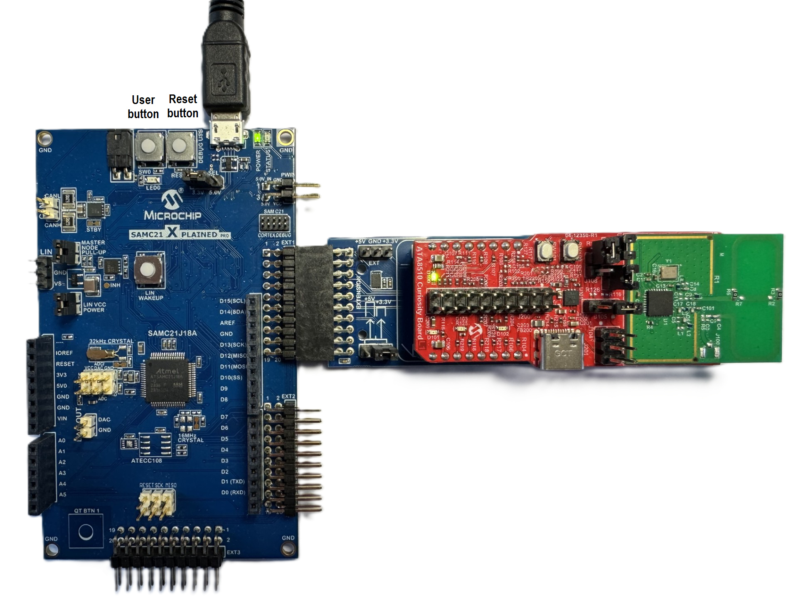
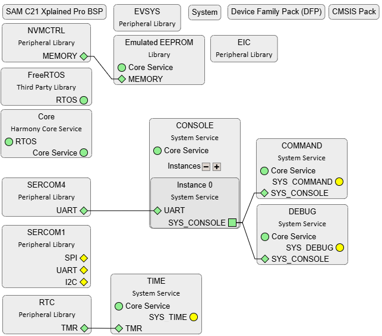
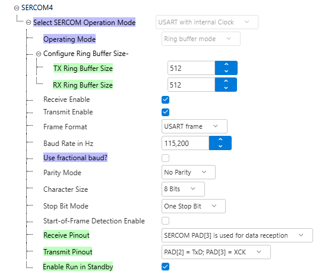
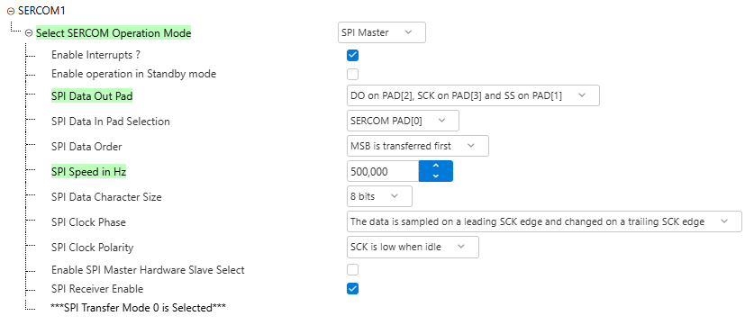
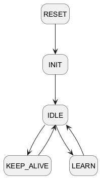
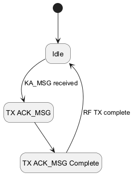
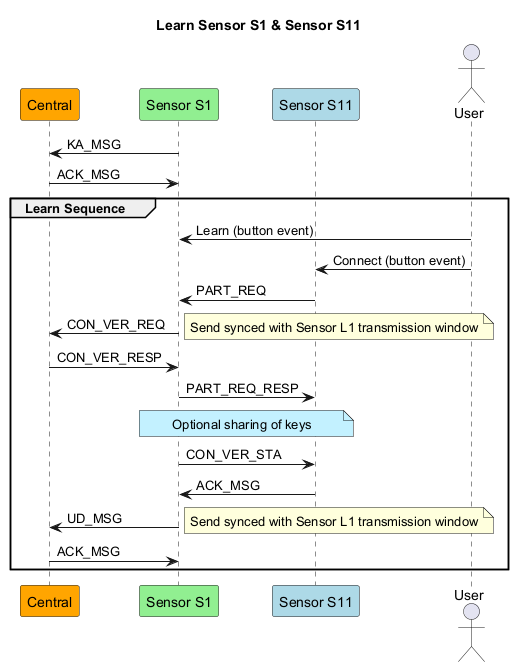
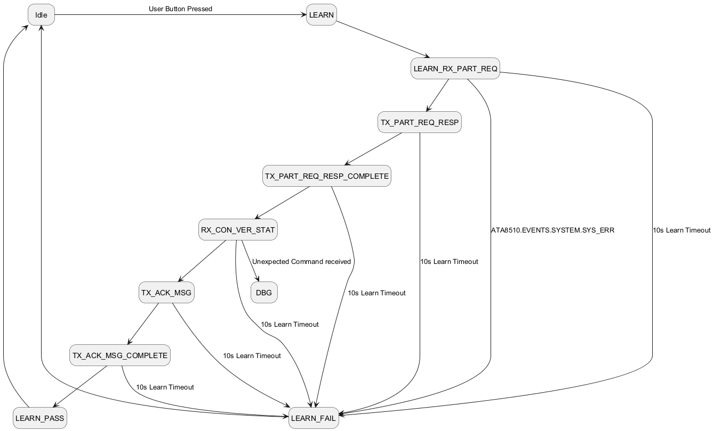
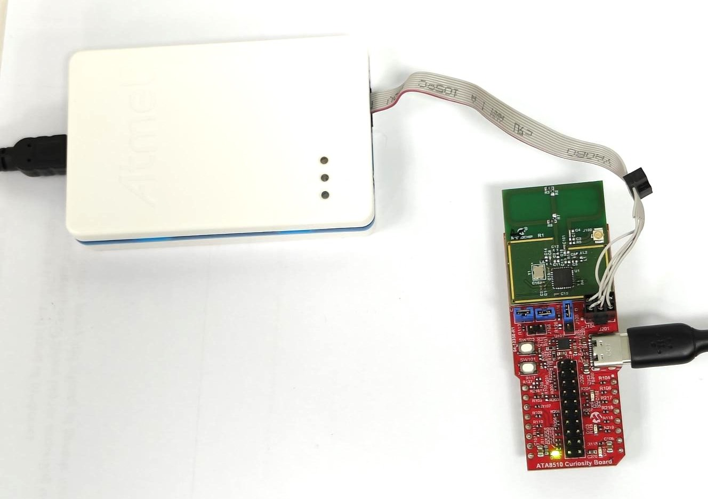
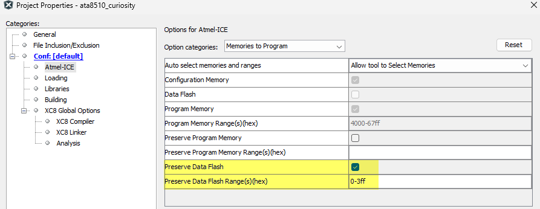

# ATA8510_RF_Alarm_System - Central Device <!-- omit in toc -->


> "IoT Made Easy!" - This application example demonstrates a scalable tree-based wireless network using the ATA8510 RF MCU to enable a reliable alarm system deployments with a large number of nodes.

Devices: **| ATA8510 | SAMC21 |**<br>
Features: **| RF network topology |**

[Back to Main page](../../README.md)

## ⚠ Disclaimer <!-- omit in toc -->

<b>
THE SOFTWARE ARE PROVIDED "AS IS" AND GIVE A PATH FOR SELF-SUPPORT AND SELF-MAINTENANCE. This repository contains example code intended to help accelerate client product development.  
<br>
<br>
For additional Microchip repos, see: <a href="https://github.com/Microchip-MPLAB-Harmony" target="_blank">https://github.com/Microchip-MPLAB-Harmony</a>
<br>
Checkout the <a href="https://microchipsupport.force.com/s/" target="_blank">Technical support portal</a> to access our knowledge base, community forums or submit support ticket requests.
</b>

## Contents<!-- omit in toc -->
- [Introduction](#introduction)
- [Bill of Materials](#bill-of-materials)
- [Hardware Setup](#hardware-setup)
- [Software Setup](#software-setup)
  - [Development Tools](#development-tools)
  - [Additional Tools](#additional-tools)
  - [MCC Content Libraries](#mcc-content-libraries)
  - [Harmony MCC Configuration](#harmony-mcc-configuration)
    - [Full Configuration](#full-configuration)
    - [System Console, Debugging and Command Line Interface](#system-console-debugging-and-command-line-interface)
    - [SPI interface](#spi-interface)
- [Overview](#overview)
  - [Reset and Init](#reset-and-init)
  - [Idle](#idle)
  - [Keep-Alive](#keep-alive)
  - [Learn](#learn)
- [Board Programming](#board-programming)
  - [ATA8510 Curiosity](#ata8510-curiosity)
    - [Connection setup](#connection-setup)
    - [Program the eeprom config hex file using MPLAB X IPE](#program-the-eeprom-config-hex-file-using-mplab-x-ipe)
  - [SAMC21 Xplained Pro](#samc21-xplained-pro)
      - [Program the precompiled hex file using MPLAB X IPE](#program-the-precompiled-hex-file-using-mplab-x-ipe)
    - [Build and program the application using MPLAB X IDE](#build-and-program-the-application-using-mplab-x-ide)
- [Related links](#related-links)

## Introduction

The Central Device is the core component of the RF‑based alarm system designed for commercial buildings. It coordinates a network of multiple sensor nodes connected in a tree‑topology architecture, ensuring reliable communication and scalable coverage across large facilities. Acting as the primary controller, the Central Device manages sensor enrollment, monitors alarm events, and distributes status updates throughout the network, forming the backbone of the overall security system.

[TOP](#contents)

## Bill of Materials

TOOLS | QUANTITY |
--     |--
[SAMC21 Xplained Pro Evaluation Kit](https://www.microchip.com/en-us/development-tool/atsamc21-xpro) | 1
[mikroBUS Xplained Pro](https://www.microchip.com/en-us/development-tool/atmbusadapter-xpro) | 1
[ATA8510 Curiosity Board](https://www.microchip.com/en-us/development-tool/ev82m22a) | 1
[Atmel-ICE](https://www.microchip.com/en-us/development-tool/atatmel-ice) or [Power Debugger](https://www.microchip.com/en-us/development-tool/atpowerdebugger) or [PICkit5](https://www.microchip.com/en-us/development-tool/pg164150) | 1


[TOP](#contents)

## Hardware Setup

1. Connect the mikroBUS Xplained Pro board to the EXT1 interface of the SAMC21 Xplained Pro Evaluation Kit
2. Plug the ATA8510 Curiosity board to the mikroBUS Xplained Pro board
3. Connect the DEBUG USB port on the kit to the PC using a USB cable (Standard‑A to Micro‑B)
4. Please set the jumper as illustrated in the image below for a 3.3V application
5. Use the following serial console settings for debug over UART

Baudrate  | Data  | Parity  | Stop bits | Flow Control
--        |--     |--       |--         |--
115200    | 8     | No      | 1         | None



[TOP](#contents)

## Software Setup

### Development Tools

- <a href="https://www.microchip.com/en-us/tools-resources/develop/mplab-x-ide" target="_blank">MPLAB® X IDE v6.25</a> or above
- MPLAB® X IDE plug-ins: MPLAB® Code Configurator (MCC) v5.6.4 and above
- MPLAB® XC32 C/C++ Compiler v5.00
- Device Pack: ATSAMC21J18A_DFP v3.9.248
- <a href="https://developerhelp.microchip.com/xwiki/bin/view/software-tools/ipe/installation/" target="_blank">MPLAB® X IPE</a>

### Additional Tools

- Any Serial terminal application like <a href="https://teratermproject.github.io/index-en.html" target="_blank">TeraTerm</a> terminal application

### MCC Content Libraries

Harmony V3 component  | version
--                    |--
csp                   | v3.25.0
core                  | v3.16.0
CMSIS_5               | v5.9.0
FreeRTOS-Kernel       | V11.2.0
bsp                   | v3.24.0

### Harmony MCC Configuration
#### Full Configuration

The full configuration is:



#### System Console, Debugging and Command Line Interface
The system console is configured to use SERCOM4 in USART mode and is accessible via the DEBUG USB connector.



In addition to standard console functions, it supports debugging and provides a command line interface for direct interaction with the board.

#### SPI interface
The system console is configured to use SERCOM1 as SPI interface between SAMC21 and ATA8510.



## Overview
This chapter describes the central application, which is implemented using the SAMC21 Xplained Pro evaluation kit and an ATA8510 Curiosity Board connected via the EXT1 extension header. It contains information about the state machines used, the various operation modes, and details the central device’s functions and its role in managing the sensor network.

The central application uses state machines with following states:

- reset and init
- idle
- keep-alive
- learn

These states and their transitions are shown in diagram below.



__Button Control__  
The SAMC21 Xplained Pro board features two buttons: a reset button connected to the reset line, and a generic user-configurable button. The following functionality is implemented:

- __Reset Button Pressed:__ Resets the central device.
- __User Button Pressed:__ Initiates the learning process.

__LED Signalling__  
By default, the User LED is switched off. When an alarm is triggered on a sensor device, the User LED is activated.  

__Command Line Interface__  
The current implementation of the command line contains the following commands:

__`VERSION?`__ - Returns the Version of the Central Device.
```  
>VERSION?
CENTRAL V1.0.0
>
```
__Note:__ Other implemented commands are intended for debugging purposes only and are therefore not documented here.  

### Reset and Init
The reset and initialization states handle the startup sequence of the central application, ensuring that both the SAMC21 Xplained Pro and the ATA8510 Curiosity Board on EXT1 are properly initialized and ready for operation.

State                 | State Machine Function
--                    |--
STATE_INIT            | STATE_Init
STATE_WAIT_RF_SYS_RDY | STATE_WaitRfSysRdy

### Idle
The idle state of the central application is entered after successful initialization. In this state, the central device waits for user input or network events, such as a button press to start the learning process or incoming messages from sensor devices. The idle state serves as a standby mode, allowing the central device to monitor the network, maintain readiness for further actions, and conserve resources until an event triggers a transition to another operational state.

Events that can transition the central device out of idle state include:

- Pressing the user button to initiate the learning process
- Receiving Keep Alive (KA) messages from a sensor device (such as a keep-alive)
- Scheduled tasks or periodic checks programmed in the application

### Keep-Alive
The central keep-alive state manages regular communication with connected sensor devices to monitor their presence and status. In this state, the central device processes incoming keep-alive messages, sends acknowledgments, and ensures the health of the network.



State                           | State Machine Function
--                              |--
STATE_ALARM                     | STATE_Alarm
STATE_ALARM_TX_ACK_MSG_COMPLETE	| STATE_AlarmTxAckMsgComplete

### Learn
In the central application, only the parent learn mode is implemented, as the central device never operates as a child within the network. This mode allows the central device to facilitate the addition of new sensor devices by managing the pairing and integration process.



The parent learn mode in the central application is managed by a dedicated state machine with the following states:

- __STATE_LEARN:__ Start the timeout timer and initiate RF receive mode.
- __STATE_LEARN_RX_PART_REQ:__ Receive the PART_REQ message from the sensor device.
- __STATE_LEARN_TX_PART_REQ_RESP:__ Create and send the PART_REQ_RESP message to the sensor device.
- __STATE_LEARN_TX_PART_REQ_RESP_COMPLETE:__ Complete the transmission of the PART_REQ_RESP message.
- __STATE_LEARN_TX_CON_VER_STAT:__ Create and send the CON_VER_STAT message to the sensor device.
- __STATE_LEARN_TX_CON_VER_STAT_COMPLETE:__ Complete the transmission of the CON_VER_STAT message.
- __STATE_LEARN_RX_ACK_MSG:__ Receive the ACK_MSG from the sensor device.
- __STATE_LEARN_PASS:__ Indicate that the learn/pairing process was successful.
- __STATE_LEARN_FAIL:__ Indicate that the learn/pairing process failed.

This sequence ensures the central device efficiently manages the pairing and integration of new sensor devices.



State                                 | State Machine Function
--                                    |--
STATE_LEARN	                          |	STATE_Learn
STATE_LEARN_RX_PART_REQ	              |	STATE_LearnRxPartReq
STATE_LEARN_TX_PART_REQ_RESP          | STATE_LearnTxPartReqResp
STATE_LEARN_TX_PART_REQ_RESP_COMPLETE	|	STATE_LearnTxPartReqRespComplete
STATE_LEARN_TX_CON_VER_STAT	          |	STATE_LearnTxConVerStat
STATE_LEARN_TX_CON_VER_STAT_COMPLETE	|	STATE_LearnTxConVerStatComplete
STATE_LEARN_RX_ACK_MSG                | STATE_LearnRxAckMsg
STATE_LEARN_PASS                      | STATE_LearnPass
STATE_LEARN_FAIL                      | STATE_LearnFail

## Board Programming

### ATA8510 Curiosity

#### Connection setup

- Remove the ATA8510 Curiosity board from the mikroBUS Xplained Pro
- Power the ATA8510 Curiosity board via the USB Type-C cable
- Connect the external debugger to the ISP header (J104)
- Ensure that the jumper is placed on header J103 between pins 1 and 2 during programming



#### Program the eeprom config hex file using MPLAB X IPE

Please refer to [EEPROM programming](../../apps/sensor/README.md#program-the-precompiled-hex-file-using-mplab-x-ipe) for the Sensor device.

Within the “Atmel-ICE” category of the “Project Properties” window, ensure that the “Preserve Data Flash”
checkbox is enabled.



### SAMC21 Xplained Pro

The SAMC21 Xplained Pro can be programmed directly from the `DEBUG USB` connector.

##### Program the precompiled hex file using MPLAB X IPE

* The precompiled HEX file `sam_c21_xplained_pro.X.production.hex` is provided in the hex folder. Follow the steps in the linked guide to <a href="https://developerhelp.microchip.com/xwiki/bin/view/software-tools/ipe/production-mode/program-device/" target="_blank">program this precompiled image using MPLAB X IPE</a>.

#### Build and program the application using MPLAB X IDE

The application folder is located at the following path.

__Path: apps\central\firmware\sam_c21_xplained_pro.X__

Follow the steps in the linked guide to <a href="https://developerhelp.microchip.com/xwiki/bin/view/software-tools/ides/x/projects/building/" target="_blank">build and program the application</a>.

[TOP](#contents)

## Related links

- [SAMC21 Xplained Pro Evaluation Kit](https://www.microchip.com/en-us/development-tool/atsamc21-xpro)
- [SAMC21 Xplained Pro User Guide](https://ww1.microchip.com/downloads/aemDocuments/documents/OTH/ProductDocuments/UserGuides/Atmel-42460-SAM-C21-Xplained-Pro_User-Guide.pdf)
- [ATA8510 Curiosity Board](https://www.microchip.com/en-us/development-tool/ev82m22a)
- [ATA8510 Curiosity Board User Guide](https://ww1.microchip.com/downloads/aemDocuments/documents/WSG/ProductDocuments/UserGuides/ATA8510-Curiosity-Board-User%27s-Guide-DS00006071.pdf)
- [mikroBUS Xplained Pro](https://www.microchip.com/en-us/development-tool/atmbusadapter-xpro)
- [mikroBUS Xplained Pro User Guide](https://ww1.microchip.com/downloads/aemDocuments/documents/OTH/ProductDocuments/UserGuides/50002671A.pdf)

[TOP](#contents)
