# ATA8510_RF_Alarm_System - Applications <!-- omit in toc -->


> "IoT Made Easy!" - This application example demonstrates a scalable tree-based wireless network using the ATA8510 RF MCU to enable a reliable alarm system deployments with a large number of nodes.

Devices: **| ATA8510 | SAMC21 |**<br>
Features: **| RF network topology |**

[Back to Main page](../README.md)

## ⚠ Disclaimer <!-- omit in toc -->

<p><span style="color:red"><b>
THE SOFTWARE ARE PROVIDED "AS IS" AND GIVE A PATH FOR SELF-SUPPORT AND SELF-MAINTENANCE. This repository contains example code intended to help accelerate client product development. </br>

For additional Microchip repos, see: <a href="https://github.com/Microchip-MPLAB-Harmony" target="_blank">https://github.com/Microchip-MPLAB-Harmony</a>

Checkout the <a href="https://microchipsupport.force.com/s/" target="_blank">Technical support portal</a> to access our knowledge base, community forums or submit support ticket requests.
</span></p></b>

## Contents<!-- omit in toc -->
- [Introduction](#introduction)
- [System Overview](#system-overview)
  - [Use Cases (Fire Alarms, Monitoring, Control)](#use-cases-fire-alarms-monitoring-control)
  - [System Diagram (High-Level Architecture)](#system-diagram-high-level-architecture)
  - [Network Topology and Architecture](#network-topology-and-architecture)
    - [Adressing and Node Identification](#adressing-and-node-identification)
    - [Network Joining and Formation](#network-joining-and-formation)
      - [Adding a Sensor to the Network](#adding-a-sensor-to-the-network)
      - [Removing a Sensor from the Network](#removing-a-sensor-from-the-network)
    - [Network Communication](#network-communication)
      - [Status Update](#status-update)
        - [Slotting](#slotting)
        - [Synchronization](#synchronization)
        - [Sensor Calibration](#sensor-calibration)
      - [Alarm](#alarm)
- [Implementation](#implementation)
  - [Protocols](#protocols)
    - [Learn](#learn)
      - [Example Sequences](#example-sequences)
        - [Learning a Sensor S1 on Level 1 (Pairing between Central and S1)](#learning-a-sensor-s1-on-level-1-pairing-between-central-and-s1)
        - [Learning a Sensor S11 on Level 2 (Pairing between S1 and S11)](#learning-a-sensor-s11-on-level-2-pairing-between-s1-and-s11)
        - [Learning a Sensor S111 on level 3 (Pairing between S11 and S111)](#learning-a-sensor-s111-on-level-3-pairing-between-s11-and-s111)
    - [Status Update - Keep Alive](#status-update---keep-alive)
      - [Example Sequences](#example-sequences-1)
        - [Status Update Communication between a Sensor S1 and the Central](#status-update-communication-between-a-sensor-s1-and-the-central)
        - [Status Update Communication between Sensors S1 \& S2 and the Central](#status-update-communication-between-sensors-s1--s2-and-the-central)
    - [Alarm](#alarm-1)
      - [Example Sequences](#example-sequences-2)
        - [Alarm Communication between a Sensor S1 and the Central](#alarm-communication-between-a-sensor-s1-and-the-central)
  - [Commands](#commands)
    - [General Structure](#general-structure)
    - [Specific Structure by MSG\_ID](#specific-structure-by-msg_id)

## Introduction

Application details, such as state machines and flowcharts, are available in the respective project documentation.

| Projects                                             | Devices                                          |
| :----------------------------------------------------| :------------------------------------------------|
| [Central device](./central/readme.md) | SAMC21 + MikroBUS Xpro + ATA8510 Curiosity Board |
| [Sensor device](./sensor/readme.md)    | ATA8510 Curiosity Board                          |

[TOP](#contents)


## System Overview

### Use Cases (Fire Alarms, Monitoring, Control)
The ATA8510 alarm system is designed for a wide range of monitoring, alarm, and control applications. Its flexible architecture makes it suitable for use in environments where reliable detection and rapid response are essential, such as building security, fire detection, and industrial monitoring. Thanks to its tree network structure, the system allows for straightforward setup and easy expansion, enabling users to add or reconfigure sensors as needed without significant effort.

By combining robust central management with intelligent, low-power sensor nodes, the ATA8510 alarm system ensures efficient operation, scalability, and adaptability to various application requirements. The following sections outline the main tasks and responsibilities of both the central and sensor devices within the network.

The central device tasks are:

- Detect and process signals from connected detectors and sensors
- Display the status of the network
- Offer a user-friendly interface for setup, operation, and maintenance

The sensor device tasks are:

- Pair or unpair with the central device or other sensors to set up a network
- Periodically send keep-alive and status information to the parent device
- Provide alarm and monitoring data when triggered
- Remain in power-saving mode as much as possible

### System Diagram (High-Level Architecture)
A tree-based network architecture is a hierarchical structure that organizes devices in a parent-child relationship, resembling a branching tree. This architecture is commonly used in sensor and alarm systems for its scalability, efficient communication, and ease of management.

**Key Features:**

- Hierarchical Structure:
Devices are arranged in levels, with a single central (root) device at the top, intermediate nodes (if any), and multiple sensor nodes (leaves) at the bottom.
- Parent-Child Relationships:
Each device (except the root) has one parent, and may have multiple child devices.
- Scalability:
New sensor nodes can be easily added by connecting them to an existing parent node.
- Efficient Communication:
Data flows from the leaf nodes up to the root, and commands or configuration can be distributed from the root down to the leaves.

**Typical Components:**

- Central Device (Root):
Manages the network, processes data, and provides user interfaces.
- Sensor Devices (Leaves): 
Collect and transmit monitoring or alarm data to their parent node.

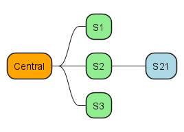

**Note**<br>
In this example, Sensor S21 is a child of Sensor S2, demonstrating how the network can branch out.

###  Network Topology and Architecture

#### Adressing and Node Identification
Each device in the network requires a unique ID for the following purposes:

- Building the network hierarchy, ensuring each device can be correctly assigned as a parent or child within the tree structure
- Identifying the source of messages, allowing the central device and other nodes to recognize where data or alerts originate

**See also**<br>
[Device Identifier](#device-identifier-id)

#### Network Joining and Formation

##### Adding a Sensor to the Network
The device ID of the sensor is the critera if the sensor is paired and part of a network or not. If the device ID is equal to the default/initial value 0xFFFF the sensor device starts child learning mode automatically after resetting the device.

The typical sequence to trigger sensor learning/pairing is as follows:

1. Start Learn (Parent Learn) on parent sensor or central
   - if learning sensor with central device, press SW0 on SAMC21 Xpro
   - if learning sensor with another sensor device apply Reset with User Switch pressed on ATA8510 Curiosity Board
2. Reset unpaired sensor device within 10 seconds.

This will start learning/pairing process between these two devices.

The device ID of the sensor is the criterion for determining whether the sensor is paired and part of a network. If the device ID is equal to the default or initial value (0xFFFF), the sensor device automatically starts child learning mode after being reset.

**Sequence to Trigger Sensor Learning/Pairing:**

1. Start Learn (Parent Learn) on Parent Sensor or Central Device
  - If pairing the sensor with the central device, press SW0 on the SAMC21 Xplained Pro.
  - If pairing the sensor with another sensor device, apply a reset with the user switch pressed on the ATA8510 Curiosity Board.
2. Reset the Unpaired Sensor Device Within 10 Seconds

This sequence initiates the learning/pairing process between the two devices.

If pairing with the central device, the following messages are exchanged during the process:

- The sensor sends a pairing request to the central device.
- The central device responds with a pairing acknowledgment.
- Configuration and network information are exchanged to complete the pairing.
  
<p align="center">

| 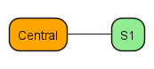 | &nbsp;&nbsp;&nbsp;&nbsp; | 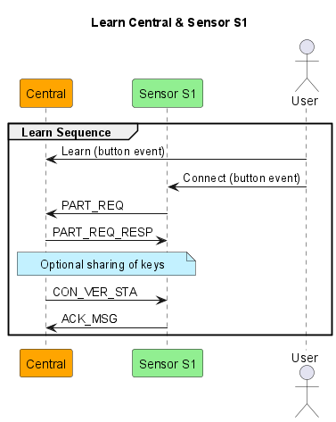 |
|----------------------------------------|-------------------------|------------------------------------------|

</p>

If pairing with another sensor device, the following messages are exchanged during the process:

- The unpaired sensor sends a pairing request to the parent sensor device.
- The parent sensor device forwards the request to the central device for verification.
- The central device responds to the parent sensor with a verification result.
- The parent sensor device sends a pairing acknowledgment to the unpaired sensor.
- Configuration and network information are exchanged to complete the pairing.

<p align="center">

| 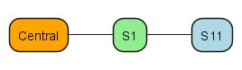 | &nbsp;&nbsp;&nbsp;&nbsp; | 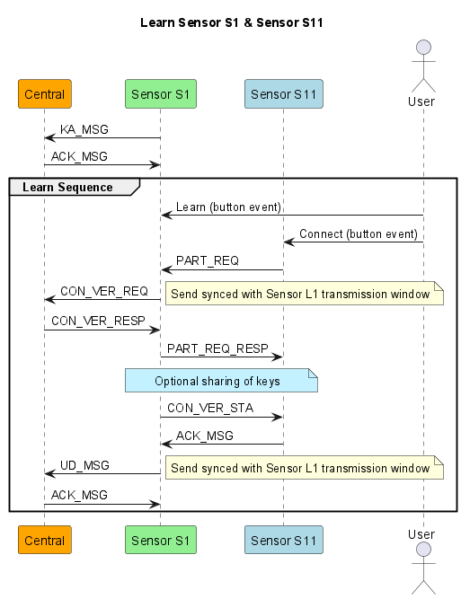 |
|----------------------------------------|-------------------------|------------------------------------------|

</p>

**Note**<br>
After the sensor device is paired and part of the network, it sends out keep-alive messages periodically every second to signal its presence to the parent device.

##### Removing a Sensor from the Network
To remove a sensor device from the network, the device ID must be reset on the sensor device. This can be accomplished as follows:

1. Apply a reset with the user switch pressed on the ATA8510 Curiosity Board. The sensor will enter parent learn mode for 10 seconds.
2. Press the user switch again to reset the device ID on the sensor.

This process effectively unpairs the sensor device, allowing it to be removed from the network and prepared for re-pairing or redeployment.

#### Network Communication
##### Status Update
After the sensor device is paired and part of the network, it sends out keep-alive messages periodically to signal its presence to the parent device. Each keep-alive message is acknowledged by the corresponding parent device with an ACK_MSG message.

The following sequence charts illustrate the status update communication between a sensor S1 at level #1 and the central device:

<p align="center">

|  | &nbsp;&nbsp;&nbsp;&nbsp; | 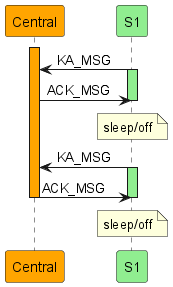 |
|----------------------------------------|-------------------------|------------------------------------------|

</p>

###### Slotting
To prevent sensor status updates from interfering with communication from other sensors on the same level, each sensor is assigned its own communication slot.

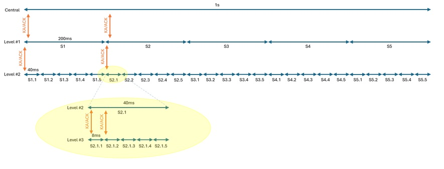

**Example:**<br>
If the update period is 1 second and there are a maximum of 5 sensors at each level, this results in a communication slot of 200 ms for each sensor in sensor level 1.

Accordingly, for 2 sensors (S1 and S2) on level #1 and the central device:

Each sensor is assigned a 200 ms communication slot within the 1-second update period. For example, S1 may transmit its status update in the first 200 ms slot, while S2 transmits in the next 200 ms slot. The central device receives and acknowledges each sensor’s message within its assigned slot, ensuring organized and collision-free communication.

<p align="center">

| 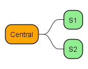 | &nbsp;&nbsp;&nbsp;&nbsp; | 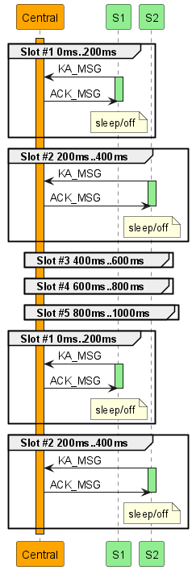 |
|----------------------------------------|-------------------------|------------------------------------------|

</p>

###### Synchronization
To achieve synchronized communication within the network, sensors should be able to adjust the timing of their keep-alive messages. This adjustment must be triggered by the parent device.

The parent device can:

- Reduce or extend the sleep/off time of the next cycle to shift the timing without changing the overall interval.
- Reduce or extend the sleep/off time of subsequent cycles to synchronize the intervals of each child sensor device.

This approach ensures that all sensors operate in coordinated time slots, minimizing communication collisions and maintaining efficient network performance.

**Note**<br>
The sycnhronization is implemented in the keep alive state machines. For a more detailed description refer to [Keep Alive](../apps/sensor/readme.md/#keep-alive) on sensor side and [Keep Alive](../apps/central/readme.md/#keep-alive) on central side.

###### Sensor Calibration
The timing for keep-alive messages is implemented using the Slow RC oscillator (SRC) as the clock input for the timer. The SRC frequency (f_src) is 125 kHz ± 10%, which introduces some variation in timing resolution.

| f_src           | Frequency | Resolution |
| --------------- | ----------| ---------- |
| f_src (typical) | 125 kHz   | 8us        |
| f_src (min)     | 112,5 kHz | 8.89us     |
| f_src (max)     | 137,5 kHz | 7.27us     |

This means the timer’s resolution, and thus the timing of keep-alive messages, can vary slightly depending on the actual frequency of the SRC oscillator.

**Example**<br>
For an interval time of 1 second, the application requires 125,000 cycles if the clock is running at the typical SRC frequency (f_src = 125 kHz).

- Typical Frequency (125 kHz):
125,000 cycles × 8 µs = 1 s
- Minimum Frequency (112.5 kHz):
125,000 cycles × 8.89 µs = 1.111 s (+111 ms)
- Maximum Frequency (137.5 kHz):
125,000 cycles × 7.27 µs = 909.1 ms (−90.9 ms)

As a result, the timing slot can vary within a range of approximately 200 ms, depending on the actual frequency of the SRC oscillator.

Conclusion To ensure accurate timing and reliable communication within the network, sensors must be calibrated using the available EEPROM settings. Proper calibration helps compensate for variations in the SRC oscillator frequency, allowing the sensors to maintain synchronized intervals and consistent performance.
For detailed instructions and parameters, refer to the chapter on EEPROM configuration.

##### Alarm
The alarm functionality allows the sensor to quickly notify the network of an alarm event. The alarm feature is activated by pressing the user switch on the ATA8510 Curiosity Board. This action triggers the sensor to send an AL_MSG message to the parent device immediately.

[TOP](#contents)

## Implementation

This chapter provides a detailed overview of the implementation for both the central and sensor applications. It describes the underlying protocols, command structures, and communication mechanisms used within the system.

### Protocols

This chapter describes the communication protocols used within the system. It provides detailed explanations of the procedures and message formats for device learning, status updates, and alarm signaling. Each section outlines how these protocols ensure reliable interaction and coordination between the central and sensor devices.

#### Learn

This chapter introduces the learning process, detailing the flow and procedures required for pairing and integrating sensor devices with the central device in the network.

The learning procedure is required for all devices that wish to access the network. It is initiated by a button event on both the node already in the network (member – MEM) and the node seeking to join (candidate – CAN).

- MEM enters continuous receive mode for 10 seconds, waiting for a participate request (PART_REQ) from the CAN. The CAN triggers this request with the corresponding button event, then activates its receive mode to wait for participate request responses (PART_REQ_RESP) from MEM.
- In the next step, MEM and CAN exchange keys for encrypted communication using member key share (MEM_KEY) and candidate key share (CAN_KEY) messages.
- After key exchange, it may be necessary to verify the candidate’s request at the central device. For this, a special procedure called member verification is available.
- At the end of the learning process, the candidate is informed of the result with a connection verification status message (CON_VER_STA), indicating whether the central device has accepted or declined the new membership.

**See also** <br>
[Central device](./central/readme.md) <br>
[Sensor device](./sensor/readme.md)

##### Example Sequences

###### Learning a Sensor S1 on Level 1 (Pairing between Central and S1)

<p align="center">

|  | &nbsp;&nbsp;&nbsp;&nbsp; |  |
|----------------------------------------|-------------------------|------------------------------------------|

</p>

###### Learning a Sensor S11 on Level 2 (Pairing between S1 and S11)

<p align="center">

|  | &nbsp;&nbsp;&nbsp;&nbsp; |  |
|----------------------------------------|-------------------------|------------------------------------------|

</p>

###### Learning a Sensor S111 on level 3 (Pairing between S11 and S111)

<p align="center">

| 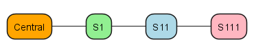 | &nbsp;&nbsp;&nbsp;&nbsp; | 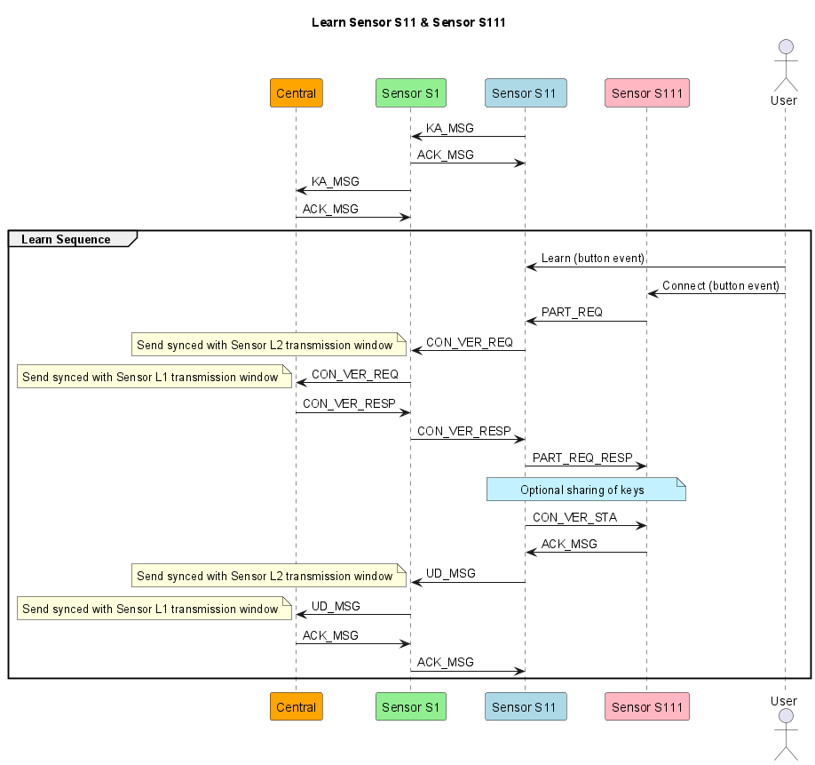 |
|----------------------------------------|-------------------------|------------------------------------------|

</p>

#### Status Update - Keep Alive

This chapter explains the communication process between sensor and central applications while in the paired state, focusing on how status updates are exchanged to maintain network integrity and monitor device activity.

**See also** <br>
[Central device](./central/readme.md) <br>
[Sensor device](./sensor/readme.md)

##### Example Sequences

###### Status Update Communication between a Sensor S1 and the Central

<p align="center">

|  | &nbsp;&nbsp;&nbsp;&nbsp; |  |
|----------------------------------------|-------------------------|------------------------------------------|

</p>

###### Status Update Communication between Sensors S1 & S2 and the Central

<p align="center">

|  | &nbsp;&nbsp;&nbsp;&nbsp; |  |
|----------------------------------------|-------------------------|------------------------------------------|

</p>

#### Alarm

This chapter describes the alarm functionality, detailing how alarm events are triggered, communicated, and processed within the network.

**See also** <br>
[Central device](./central/readme.md) <br>
[Sensor device](./sensor/readme.md)

##### Example Sequences

###### Alarm Communication between a Sensor S1 and the Central

<p align="center">

|  | &nbsp;&nbsp;&nbsp;&nbsp; | 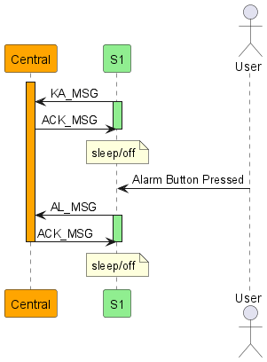 |
|-----------------------------------------|--------------------------|--------------------------------------------|

</p>

[TOP](#contents)

### Commands

#### General Structure

Every command follows the structure below. Some specific commands may include additional payload after the status field.

| 1   | 2    | 3  | 4   | 5   | 6        | 7   |
| --  | --   | -- | --  | --  | --       | --  |
| PRE | SFID | ID | MSG | STA | OPTIONAL | CRC |


| Name     | Description            |
| --       | --                     |
| PRE      | Preamble               |
| SFID     | Start Frame Identifier |
| ID       | Device Identifier      |
| MSG      | Message Identifier     |
| STA      | Status                 |
| Optional | Additional information that can be added  |
| CRC      | Checksum (not implemented)  |

This structure ensures consistent and reliable communication between devices in the network.

##### Synchronization (PRE and SFID) <!-- omit in toc -->

The preamble and start frame ID indicate the beginning of an information transfer. The receiver uses the preamble to synchronize with the incoming message: the first eight bytes allow the RF hardware to align with the signal, while the second preamble byte assists with clock recovery and data‑rate synchronization. The start frame ID then provides a unique marker identifying the start of the payload.

| Structure      | Content |
| --             | --      |
| Preamble       | 0x5555  |
| Start Frame ID | 0x4E    |

##### Device Identifier (ID)<!-- omit in toc -->

Each device in the network requires a unique ID for the following purposes:

- Building the network hierarchy, ensuring each device can be correctly assigned as a parent or child within the tree structure
- Identifying the source of messages, allowing the central device and other nodes to recognize where data or alerts originate

Each device in the network is assigned a 16-bit unique identifier, which is calculated using the ATA8510 production data stored in the device’s EEPROM. The relevant production data includes:

- 8-byte lot number
- 1-byte wafer number
- 2-byte X and Y coordinates
- 1-byte CRC

**Device ID Calculation:**
The 16-bit device ID is generated by summing the 12 bytes of production data starting at EEPROM address 0x0410, and then masking the result to 12 bits. The calculation is performed as follows:

```
app_data.device_id = 0;
for (int i=0; i<12; i++) {
    app_data.device_id += eeprom_read_byte((const uint8_t *)(0x0410 + i));
}
app_data.device_id &= 0x0FFF;
```
The four most significant bits (MSB) of the device ID contain the actual level of the device in the network hierarchy.

**Note** <br>
The calculation of the device ID is performed during the learn process of the sensor and is stored in the EEPROM after successful learning. A device ID not equal to 0xFFFF indicates that the sensor is paired.

##### Message Identifier (MSG) <!-- omit in toc -->

The message identifier indicates the type of message being transmitted. Depending on the message type, the subsequent content of the message can vary. Additionally, a consistency check can be applied using flow control mechanisms to ensure reliable communication and message integrity.

| Command       | MSG  | Description                                 |
| --            | --   | --                                          |
| KA_MSG        | 0x03 | Keep Alive Message ID                       |
| UD_MSG        | 0x04 | Update Message ID                           |
| ACK_MSG       | 0x05 | Achnowledge Message ID                      |
| AL_MSG        | 0x06 | Alarm Message ID                            |
| PART_REQ      | 0x07 | Participation Request Message ID            |
| PART_REQ_RESP | 0x08 | Participation Request Response  Message ID  |
| MEM_KEY       | 0x09 | Member Key Exchange Message ID              |
| CAN_KEY       | 0x0A | Candidate Key Exchange Message ID           |
| CON_VER_STA   | 0x0B | Connection Verification Status Message ID   |
| CON_VER_REQ   | 0x0C | Connection Verification Request Message ID  |
| CON_VER_RESP  | 0x0D | Connection Verification Response Message ID |
| PAY_MSG       | 0x0E | Payload Message ID                          |

See also `eMsg_T`

##### Status (STA) <!-- omit in toc -->
The status field contains general information about the node, as summarized in the table below:

<table>
  <tr>
    <th width="80" align="left">Bit</th>
    <th width="200" align="left">Description</th>
    <th align="left">Comment</th>
  </tr>

  <tr>
    <td nowrap><code>Bit 0</code></td>
    <td nowrap>Central device Update</td>
    <td>If this bit is set, the upper-level device is notified about a verification of the ongoing request at the Central device. This enables the upper-level devices to stay in receive mode waiting for response from the Central device.</td>
  </tr>

  <tr>
    <td nowrap><code>Bit 1</code></td>
    <td nowrap>Accept Device</td>
    <td>-</td>
  </tr>

  <tr>
    <td nowrap><code>Bit 2</code></td>
    <td nowrap>Clear Blocked List</td>
    <td>-</td>
  </tr>

  <tr>
    <td nowrap><code>Bit 3</code></td>
    <td nowrap>Payload</td>
    <td>If this bit is set to 1, it indicates there is more communication required and a payload message will be triggered after this message.</td>
  </tr>

  <tr>
    <td nowrap><code>Bit 4</code></td>
    <td nowrap>Security</td>
    <td>If this bit is set, security is used for next communication.</td>
  </tr>

  <tr>
    <td nowrap><code>Bit 5</code></td>
    <td nowrap>Okay</td>
    <td>If this bit is set to 1, the last command is understood.</td>
  </tr>

  <tr>
    <td nowrap><code>Bit 6</code></td>
    <td nowrap>Network</td>
    <td>If this bit is set to 1, there are further levels above this level. That means it’s not the end of the branch.</td>
  </tr>

  <tr>
    <td nowrap><code>Bit 7</code></td>
    <td nowrap>Battery</td>
    <td>If this bit is set to 1, battery voltage is below the configured threshold.</td>
  </tr>
</table>

This field allows the receiving device to quickly assess the current state of the sending node.

See also `sStatus_T`

#### Specific Structure by MSG_ID

##### KA_MSG <!-- omit in toc -->

The keep-alive message is a regular communication initiated by the upper-level device. It is answered by the receiving device with either an ACK_MSG (acknowledgment message) or a UD_MSG (update message).

##### UD_MSG <!-- omit in toc -->

The update message (UD_MSG) includes an additional update field of variable length, which is inserted between the STA (status) field and the CRC (checksum) field. This message is used to maintain the network by sharing information such as details about the network topology.

The structure of the update field is as follows:

- Length: The first byte specifies the total length of the update field (including all parameters and update information).
- Parameter: Indicates the type of information being shared.
    See also `eUdMsgId_T`

- Update: Contains the new value or information for the specified parameter.

The information block is organized into subfields, each consisting of a parameter and its corresponding update value. This flexible structure allows the network to be dynamically updated and maintained as needed.

##### ACK_MSG <!-- omit in toc -->

The acknowledge message (ACK_MSG) is used to indicate that an initiated communication was received correctly. There is no additional information included in the ACK_MSG. Alternatively, a UD_MSG can be used instead of an ACK_MSG if there is a need to share additional information.

See also `sCommandAckMsg_`

> **TODO: Use UD_MSG instead of ACK_MSG if correction values are transmitted **

##### AL_MSG <!-- omit in toc -->

Alarm messages (AL_MSG) have the highest priority in the system, ensuring they are transmitted and processed before any other type of communication.

See also `sCommandAlMsg_T`

##### PART_REQ <!-- omit in toc -->

The participation request command (PART_REQ) includes one additional byte called the device type

See also `sCommandPartReq`

##### PART_REQ_RESP <!-- omit in toc -->

The participation request response command (PART_REQ_RESP) does not include any additional payload.

See also `sCommandPartReqResp_T`

##### MEM_KEY <!-- omit in toc -->

Member key exchange message (MEM_KEY)

**Note** 
not used at the moment
 
##### CAN_KEY <!-- omit in toc -->

Candidate key exchange message (CAN_KEY)

**Note** 
not used at the moment

##### CON_VER_STA <!-- omit in toc -->

> **TODO: Add/Update content **

See also `sCommandConVerSta_T`

##### CON_VER_REQ <!-- omit in toc -->

> **TODO: Add/Update content **

See also `sCommandConVerReq_T`

##### CON_VER_RESP <!-- omit in toc -->

> **TODO: Add/Update content **

See also `sConVerResp_T`

##### PAY_MSG <!-- omit in toc -->
Payroll message (PAY_MSG)

**Note** 
not used at the moment

[TOP](#contents)