# ATA8510_RF_Alarm_System - Sensor Device <!-- omit in toc -->

> "IoT Made Easy!" - This application example demonstrates a scalable tree-based wireless network using the ATA8510 RF MCU to enable a reliable alarm system deployments with a large number of nodes.

Devices: **| ATA8510 |** 
Features: **| RF network topology |**

[Back to Main page](../../README.md)

## ⚠ Disclaimer <!-- omit in toc -->

<b>
THE SOFTWARE ARE PROVIDED "AS IS" AND GIVE A PATH FOR SELF-SUPPORT AND SELF-MAINTENANCE. This repository contains example code intended to help accelerate client product development.  

For additional Microchip repos, see: <a href="https://github.com/Microchip-MPLAB-Harmony" target="_blank">https://github.com/Microchip-MPLAB-Harmony</a>

Checkout the <a href="https://microchipsupport.force.com/s/" target="_blank">Technical support portal</a> to access our knowledge base, community forums or submit support ticket requests.

</b>

## Contents<!-- omit in toc -->
- [Introduction](#introduction)
- [Bill of Materials](#bill-of-materials)
- [Hardware Setup](#hardware-setup)
- [Software Setup](#software-setup)
  - [Development Tools](#development-tools)
- [Overview](#overview)
  - [Reset](#reset)
  - [Idle](#idle)
  - [Alarm](#alarm)
  - [Keep-Alive](#keep-alive)
  - [Learn](#learn)
    - [Child Learn](#child-learn)
    - [Parent Learn](#parent-learn)
  - [Reset Device Id](#reset-device-id)
  - [EEPROM configuration](#eeprom-configuration)
- [Board Programming](#board-programming)
  - [Connection setup](#connection-setup)
  - [Program the precompiled hex file using MPLAB X IPE](#program-the-precompiled-hex-file-using-mplab-x-ipe)
  - [Build and program the application using MPLAB X IDE](#build-and-program-the-application-using-mplab-x-ide)
  - [EEPROM programming](#eeprom-programming)
- [Related links](#related-links)

## Introduction

The Sensor Device is a battery‑powered node in the RF alarm system, designed to detect local events—such as motion or smoke—and report them to the Central Device. Multiple sensors can be deployed throughout a commercial building, forming a scalable tree‑topology network that ensures robust coverage. Each sensor communicates wirelessly with its parent node or directly with the central unit, enabling fast event reporting, enrollment, and status updates across the entire system.

[TOP](#contents)

## Bill of Materials

| TOOLS | QUANTITY |
| :-    | :-       |
| [ATA8510 Curiosity Board](https://www.microchip.com/en-us/development-tool/ev82m22a) | 2 - 5 |
| [Atmel-ICE](https://www.microchip.com/en-us/development-tool/atatmel-ice) or [Power Debugger](https://www.microchip.com/en-us/development-tool/atpowerdebugger) or [PICkit5](https://www.microchip.com/en-us/development-tool/pg164150) | 1 |

[TOP](#contents)

## Hardware Setup

1. Power up the ATA8510 Curiosity Board by connecting a USB Type‑C cable to connector J201
2. Please set the jumper as illustrated in the image below for a 3.3V application

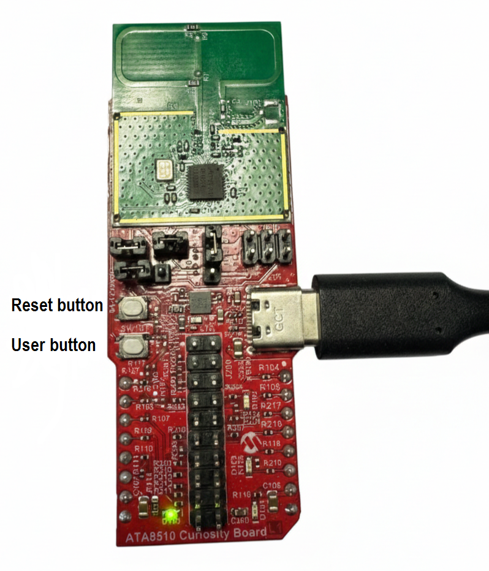

[TOP](#contents)

## Software Setup

### Development Tools

- <a href="https://www.microchip.com/en-us/tools-resources/develop/mplab-x-ide" target="_blank">MPLAB® X IDE v6.25</a> or above
- MPLAB® X IDE plug-ins: MPLAB® Code Configurator (MCC) v5.6.4 and above
- MPLAB® XC32 C/C++ Compiler v5.00
- <a href="https://developerhelp.microchip.com/xwiki/bin/view/software-tools/ipe/installation/" target="_blank">MPLAB® X IPE</a>

[TOP](#contents)

## Overview
This section provides an overview of the sensor application, which is based on the ATA8510 Curiosity Board. It describes the main functions, operational modes, and interactions of the sensor within the network. The section also explains how the sensor device communicates with the central device and other sensors, manages status updates, and responds to events such as pairing and alarms.

The sensor application operates as a state machine with the following states:

- Reset
- Idle
- Alarm
- Keep Alive
- Learn including sub states
  - Child Learn
  - Parent Learn
  - Reset Device ID

These states and their transitions are shown in the diagram below.

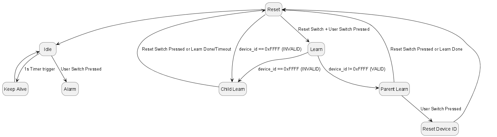

**Button Control** 
These states can be entered using the two buttons on the ATA8510 Curiosity Board. The sensor device, based on the ATA8510 Curiosity Board, includes two buttons for control:

- **Reset Button**
- **User Button**

The following button sequences are implemented:

| Button Sequence                              | Function               |
| :-                                           | :-                     |
Reset Button Pressed                           | Reset Sensor Device    |
Reset Button + User Button Pressed             | Enter Learn Mode       |
User Button Pressed during Learn Mode          | Reset Sensor Device ID |
User Button Pressed during Idle and Keep Alive | Set Alarm              |

These button combinations allow users to easily reset the sensor, trigger an alarm, or initiate the learning process.

**LED Signalling**

> **TODO: Add comment**
> 
The two on‑board user LEDs indicate the application’s operating states.

| Component | Description    | Pin on ATA8510 RF board     |
| :-        | :-             | :-                          |
| D100      | 3.3V Green LED | -                           |
| D101      | 5V Green LED   | -                           |
| D102      | User Red LED   | PB7                         |
| D103      | User Green LED | PC5                         |

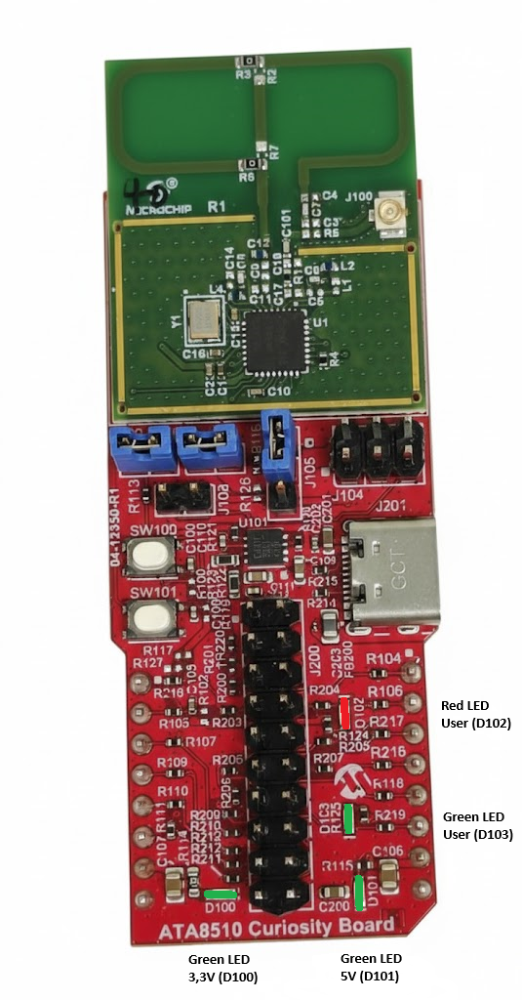  

### Reset
Reset mode is entered when the reset button is pressed or when the device exits off/sleep mode. The reset state serves as the initial and central state from which all other states can be accessed. After a reset, the application executes initialization routines and then transitions to either idle, alarm, keep-alive, or learn mode.

### Idle
Idle mode is entered from the reset state if the device has a valid device ID, indicating that it is part of the network.
From idle mode, the device can transition to either the keep-alive state or the alarm state.
The keep-alive state is entered automatically after idle to signal presence to the parent device, while the alarm state is entered by pressing the user button.

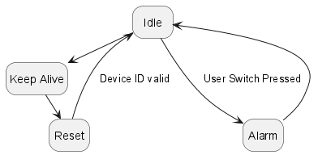  

### Alarm
The alarm state, which holds the highest priority, is activated by pressing the user button, either from idle mode or directly from the keep-alive state. When the alarm state is active, all other processes are suspended to ensure the alarm message is sent immediately and receives priority handling within the system. After the alarm has been processed and acknowledged, the device returns to its normal operating state.

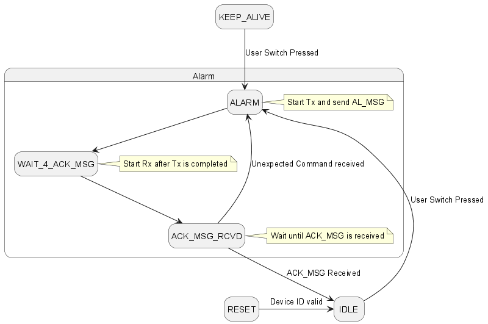  

| State                        | State Machine Function       |
| :-                           | :-                           |
| STATE_ALARM                  | state_alarm                  |
| STATE_ALARM_START_RX_ACK_MSG | state_alarm_start_rx_ack_msg |
| STATE_ALARM_RX_ACK_MSG       | state_alarm_rx_ack_msg       |

### Keep-Alive
This chapter introduces the child sensor keep-alive state machine, describing how the sensor device manages periodic status updates, maintains communication with its parent device, and ensures reliable presence detection within the network.

In keep-alive processing, the sensor first sends a keep-alive message to its parent device. Afterwards, it processes keep-alive messages from its child sensors. The acknowledgment (ACK) message received from the parent contains correction values, which are then forwarded to the child sensors.
The main states and their functions are as follows:

- **STATE_KEEP_ALIVE:** Starts the 1-second interval timer to initiate the keep-alive process.
- **STATE_KEEP_ALIVE_TX_KA_MSG:** Creates and sends the KA_MSG (keep-alive message) to the parent device.
- **STATE_KEEP_ALIVE_START_RX_ACK:** Switches to RF receive mode after transmitting the KA_MSG, preparing to receive an acknowledgment.
- **STATE_KEEP_ALIVE_RX_ACK:** Upon receiving an ACK_MSG, applies any correction values. If no child sensors are present, the device enters sleep mode (STATE_KEEP_ALIVE_SLEEP). If child sensors are present, the device continues keep-alive processing for them by starting RF receive mode.
- **STATE_KEEP_ALIVE_PROCESS_CHILD_RX_KA_MSG:** Receives a KA_MSG from a child sensor.
- **STATE_KEEP_ALIVE_PROCESS_CHILD_TX_ACK_MSG:** Creates and sends an ACK_MSG (including correction values) back to the child sensor.
- **STATE_KEEP_ALIVE_PROCESS_CHILD_TX_ACK_MSG_COMPLETE:** Completes the transmission of the ACK_MSG. If additional child sensors are present, the process continues for the next child.
- **STATE_KEEP_ALIVE_SLEEP:** Enters sleep mode, waking up either due to an alarm event or when the interval timer expires.

This state machine ensures that each sensor maintains regular communication, processes messages from child sensors, and efficiently manages power consumption by entering sleep mode when appropriate.

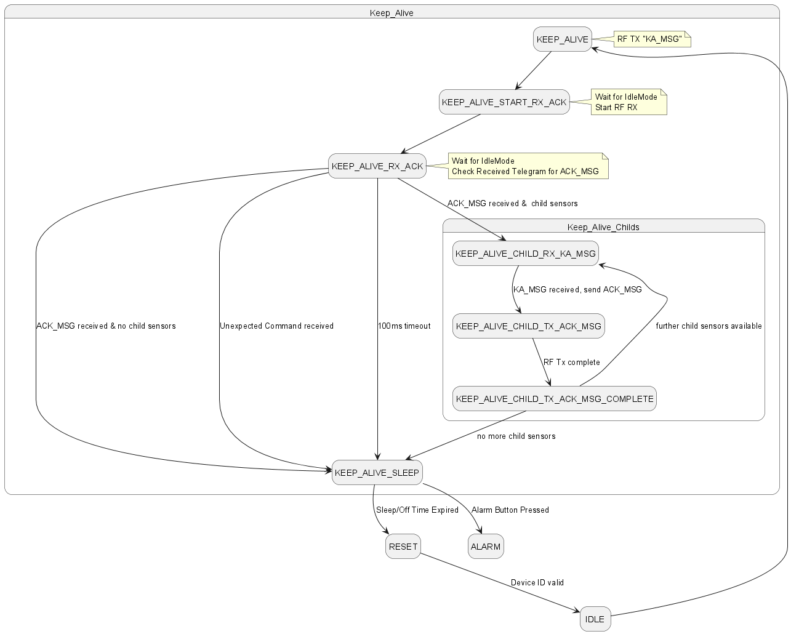  

| State                                              | State Machine Function                             |
| :-                                                 | :-                                                 |
| STATE_KEEP_ALIVE                                   | state_keep_alive                                   |
| STATE_KEEP_ALIVE_TX_KA_MSG                         | state_keep_alive_tx_ka_msg                         |
| STATE_KEEP_ALIVE_START_RX_ACK                      | state_keep_alive_start_rx_ack                      |
| STATE_KEEP_ALIVE_RX_ACK                            | state_keep_alive_rx_ack                            |
| STATE_KEEP_ALIVE_PROCESS_CHILD_RX_KA_MSG           | state_keep_alive_process_child_rx_ka_msg           |
| STATE_KEEP_ALIVE_PROCESS_CHILD_TX_ACK_MSG          | state_keep_alive_process_child_tx_ack_msg          |
| STATE_KEEP_ALIVE_PROCESS_CHILD_TX_ACK_MSG_COMPLETE | state_keep_alive_process_child_tx_ack_msg_complete |
| STATE_KEEP_ALIVE_SLEEP                             | state_keep_alive_sleep                             |

### Learn
The sensor learning process is managed by two dedicated state machines: one for child learning and one for parent learning. In child learning, the sensor is added to the network as a new device. In parent learning, the sensor is already part of the network and facilitates the addition of a child sensor.

  

#### Child Learn
This chapter describes the child learning process, detailing how a sensor device is added to the network as a new node through a dedicated state machine and specific pairing procedures. The child learning state machine guides this process with the following states:

- **STATE_CHILD_SENSOR_LEARN_TX_PART_REQ:** Sends the PART_REQ command to the parent device to initiate pairing.
- **STATE_CHILD_SENSOR_LEARN_START_RX_PART_REQ_RESP:** Starts RF receive mode to wait for the PART_REQ_RESP message from the parent.
- **STATE_CHILD_SENSOR_LEARN_RX_PART_REQ_RESP:** Receives the PART_REQ_RESP message and restarts RF receive mode for further communication.
- **STATE_CHILD_SENSOR_LEARN_RX_CON_VER_STAT:** Receives the CON_VER_STAT message, indicating the connection verification status.
- **STATE_CHILD_SENSOR_LEARN_TX_ACK_MSG:** Creates an ACK_MSG and starts RF transmission to acknowledge receipt.
- **STATE_CHILD_SENSOR_LEARN_TX_ACK_MSG_COMPLETE:** Completes the transmission of the ACK_MSG.

This sequence ensures secure and reliable integration of the sensor device into the network.

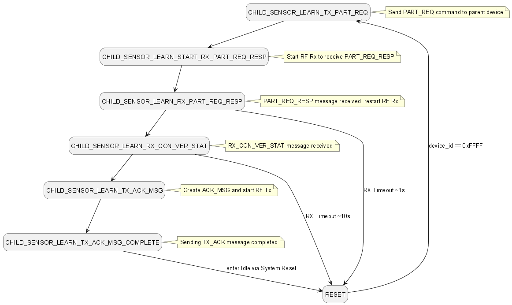  

| State                                           | State Machine Function                          |
| :-                                              | :-                                              |
| STATE_CHILD_SENSOR_LEARN_TX_PART_REQ            | state_child_sensor_learn_tx_part_req            |
| STATE_CHILD_SENSOR_LEARN_START_RX_PART_REQ_RESP | state_child_sensor_learn_start_rx_part_req_resp |
| STATE_CHILD_SENSOR_LEARN_RX_PART_REQ_RESP       | state_child_sensor_learn_rx_part_req_resp       |
| STATE_CHILD_SENSOR_LEARN_RX_CON_VER_STAT        | state_child_sensor_learn_rx_con_ver_stat        |
| STATE_CHILD_SENSOR_LEARN_TX_ACK_MSG             | state_child_sensor_learn_tx_ack_msg             |
| STATE_CHILD_SENSOR_LEARN_TX_ACK_MSG_COMPLETE    | state_child_sensor_learn_tx_ack_msg_complete    |

#### Parent Learn
This chapter explains the parent learning process, in which a sensor device that is already part of the network facilitates the addition of a new child sensor through a dedicated state machine and defined communication steps. The parent learning state machine includes the following states:

- **STATE_PARENT_LEARN_START_RX_PART_REQ:** Start RF receive mode to receive the PART_REQ message from the child sensor.
- **STATE_PARENT_LEARN_RX_PART_REQ:** PART_REQ message received from the child sensor.
- **STATE_PARENT_LEARN_TX_CON_VER_REQ:** Start RF transmit mode and send the CON_VER_REQ message to the parent sensor.
- **STATE_PARENT_LEARN_START_RX_CON_VER_RESP:** Start RF receive mode to receive the CON_VER_RESP message from the parent sensor.
- **STATE_PARENT_LEARN_RX_CON_VER_RESP:** CON_VER_RESP message received from the parent sensor.
- **STATE_PARENT_LEARN_TX_PART_REQ_RESP:** Start RF transmit mode and send the PART_REQ_RESP message to the child sensor.
- **STATE_PARENT_LEARN_TX_CON_VER_STAT:** Start RF transmit mode and send the CON_VER_STAT message to the child sensor.
- **STATE_PARENT_LEARN_START_RX_ACK_MSG:** Start RF receive mode to receive the ACK_MSG from the child sensor.
- **STATE_PARENT_LEARN_RX_ACK_MSG:** ACK_MSG received from the child sensor.
- **STATE_PARENT_LEARN_TX_UD_MSG:** Start RF transmit mode and send the UD_MSG to the parent sensor.
- **STATE_PARENT_LEARN_START_RX_ACK_MSG_UD:** Start RF receive mode to receive the ACK_MSG from the parent sensor.
- **STATE_PARENT_LEARN_RX_ACK_MSG_UD:** ACK_MSG received from the parent sensor.

This sequence ensures that the parent sensor manages the integration of a new child sensor efficiently and reliably within the network.

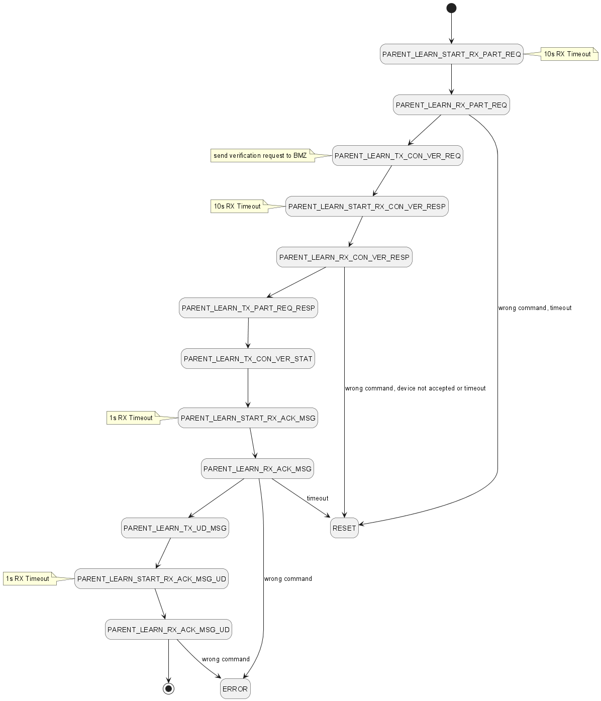  

| State                                    | State Machine Function                          |
| :-                                       | :-                                              |
| STATE_PARENT_LEARN_START_RX_PART_REQ     | state_parent_sensor_learn_start_rx_part_req     |
| STATE_PARENT_LEARN_RX_PART_REQ           | state_parent_sensor_learn_rx_part_req           |
| STATE_PARENT_LEARN_TX_CON_VER_REQ        | state_parent_sensor_learn_tx_con_ver_req        |
| STATE_PARENT_LEARN_START_RX_CON_VER_RESP | state_parent_sensor_learn_start_rx_con_ver_resp |
| STATE_PARENT_LEARN_RX_CON_VER_RESP       | state_parent_sensor_learn_rx_con_ver_resp       |
| STATE_PARENT_LEARN_TX_PART_REQ_RESP      | state_parent_sensor_learn_tx_part_req_resp      |
| STATE_PARENT_LEARN_TX_CON_VER_STAT       | state_parent_sensor_learn_tx_con_ver_stat       |
| STATE_PARENT_LEARN_START_RX_ACK_MSG      | state_parent_sensor_learn_start_rx_ack_msg      |
| STATE_PARENT_LEARN_RX_ACK_MSG            | state_parent_sensor_learn_rx_ack_msg            |
| STATE_PARENT_LEARN_TX_UD_MSG             | state_parent_sensor_learn_tx_ud_msg             |
| STATE_PARENT_LEARN_START_RX_ACK_MSG_UD   | state_parent_sensor_learn_start_rx_ack_msg_ud   |
| STATE_PARENT_LEARN_RX_ACK_MSG_UD         | state_parent_sensor_learn_rx_ack_msg_ud         |

### Reset Device Id

**See also** 
[Removing a Sensor from the Network](/apps/readme.md#removing-a-sensor-from-the-network)

### EEPROM configuration

| EEPROM Address | Variable             | Description                                                     |
| :-             | :-                   | :-                                                              |
| 0x280..0x281   | app_data.device_id   | 16-bit Device-ID, see sAppData_T.device_id                      |
| 0x282..0x283   | app_data.parent_id   | 16-bit Device-ID of the parent device, see sAppData_T.parent_id |
| 0x284..0x285   | app_data.child_id[0] | 16-bit Device-ID of the child id #0, see sAppData_T.child_id    |
| 0x286..0x287   | app_data.child_id[1] | 16-bit Device-ID of the child id #1, see sAppData_T.child_id    |
| 0x288..0x289   | app_data.child_id[2] | 16-bit Device-ID of the child id #2, see sAppData_T.child_id    |
| 0x28A..0x28B   | app_data.child_id[3] | 16-bit Device-ID of the child id #3, see sAppData_T.child_id    |
| 0x28C..0x28D   | app_data.child_id[4] | 16-bit Device-ID of the child id #4, see sAppData_T.child_id    |
| 0x28E..0x28F   | app_data.ka_interval_correction | correction value to synchronize interval for KA_MSG processing (default: 0 = ~0ms ), see sAppData_T.ka_interval_correction |
| 0x290..0x291   | app_data.rx_window_upper_treshold | rx_window upper threshold (default: 200 = ~100ms), see sAppData_T.rx_window_upper_threshold |
| 0x292..0x293   | app_data.rx_window_lower_treshold | rx_window lower threshold (default: 80 = ~40ms), see sAppData_T.rx_window_lower_threshold |
| 0x294..0x295   | app_data.correction_offset_up | correction_offset applied when rx_window > rx_window upper threshold (default: 40 = ~20ms), see sAppData_T.correction_offset_up |
| 0x296..0x297   | app_data.correction_interval_up | correction_interval applied when rx_window > rx_window upper threshold (default: 0 = ~0ms), see sAppData_T.correction_interval_up |
| 0x298..0x299   | app_data.correction_offset_mid | correction_offset applied when lower threshold < rx_window < upper_threshold (default: -10 = ~-5ms), see sAppData_T.correction_offset_mid |
| 0x29A..0x29B   | app_data.correction_interval_mid | correction_interval applied when lower threshold < rx_window < upper_threshold (default: -10 = ~-5ms), see sAppData_T.correction_interval_mid |
| 0x29C..0x29D   | app_data.correction_offset_low | correction_offset applied when rx_window < upper_threshold (default: 40 = ~20ms), see sAppData_T.correction_offset_low |
| 0x29E..0x29F   | app_data.correction_interval_low | correction_interval applied when rx_window < upper_threshold (default: 10 = ~5ms), see sAppData_T.correction_interval_low |

[TOP](#contents)

## Board Programming

### Connection setup

- Connect the external debugger to the ISP header (J104)
- Ensure that the jumper is placed on header J103 between pins 1 and 2 during programming

### Program the precompiled hex file using MPLAB X IPE

* The precompiled HEX file `ata8510_curiosity.X.production.hex` is provided in the hex folder. Follow the steps in the linked guide to <a href="https://developerhelp.microchip.com/xwiki/bin/view/software-tools/ipe/production-mode/program-device/" target="_blank">program this precompiled image using MPLAB X IPE</a>.

### Build and program the application using MPLAB X IDE

The application folder is located at the following path.

**Path: apps\sensor\firmware\ata8510_curiosity.X"**

Follow the steps in the linked guide to <a href="https://developerhelp.microchip.com/xwiki/bin/view/software-tools/ides/x/projects/building/" target="_blank">build and program the application</a>.

### EEPROM programming

1. Place the EEPROM hex file (ATA8510_EEPROM.hex) in the project directory (ata8510_curiosity.X).
2. Make a copy of the EEPROM hex file, rename it (for example, ATA8510_EEPROM_offset.hex) and place it in the same project directory.
3. Within the “Building” category of the “Project Properties” window, add the following to the “Execute this line before build” box (ensure that the check box is enabled): 

 `hexmate r0-3ffs810000,ATA8510_EEPROM.hex -oATA8510_EEPROM_offset.hex`

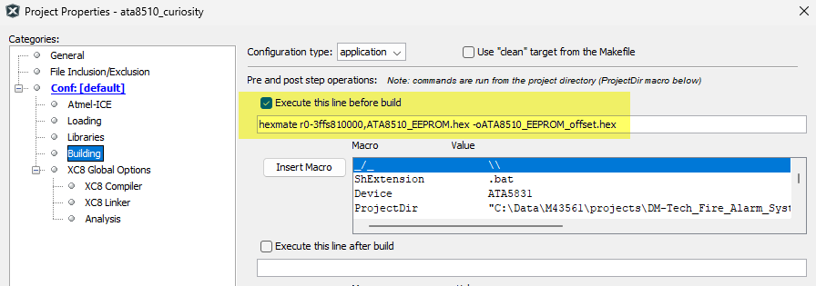

4. Within the “Loading” category of the “Project Properties” window, click the “Add Loadable File…” button, then add the renamed copy of the EEPROM hex file (ATA8510_EEPROM_offset.hex).

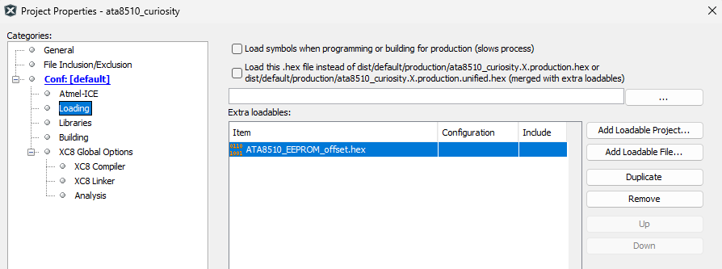

5. Within the “Atmel-ICE” category of the “Project Properties” window, ensure that the “Preserve Data Flash”
checkbox is disabled.

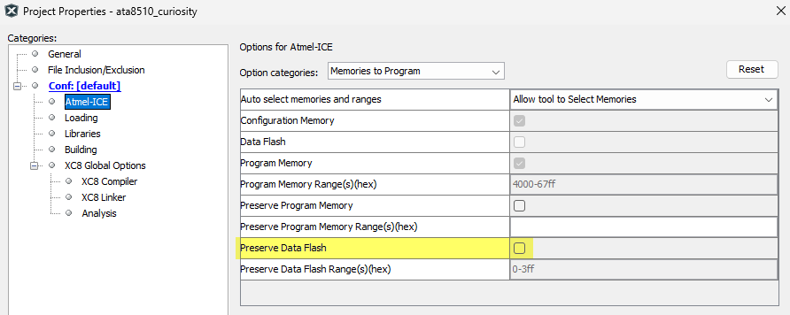

As a result, an additional hex file ( `ata8510_curiosity.X.production.unified.hex`) is generated and available after building the project.  
This hex files includes the firmware and the EEPROM settings. It can be programmed as shown in [chapter Program the precompiled hex file using MPLAB X IPE](#program-the-precompiled-hex-file-using-mplab-x-ipe).

## Related links

- [ATA8510 Curiosity Board](https://www.microchip.com/en-us/development-tool/ev82m22a)
- [ATA8510 Curiosity Board User Guide](https://ww1.microchip.com/downloads/aemDocuments/documents/WSG/ProductDocuments/UserGuides/ATA8510-Curiosity-Board-User%27s-Guide-DS00006071.pdf)

[TOP](#contents)